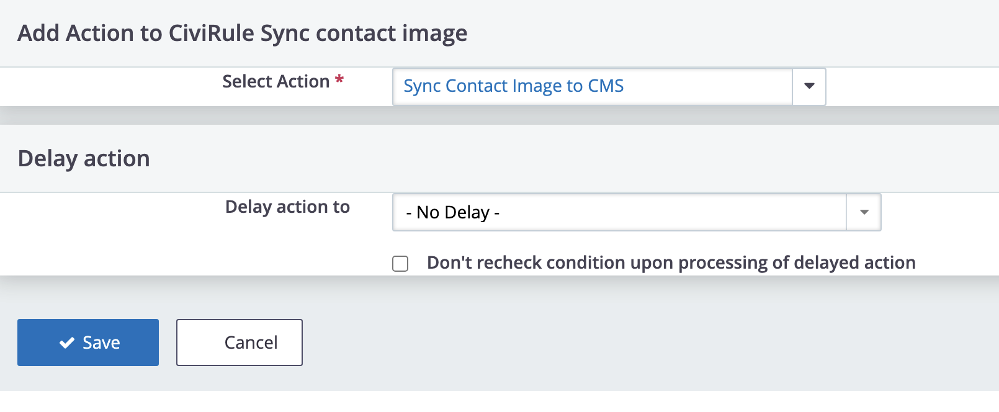
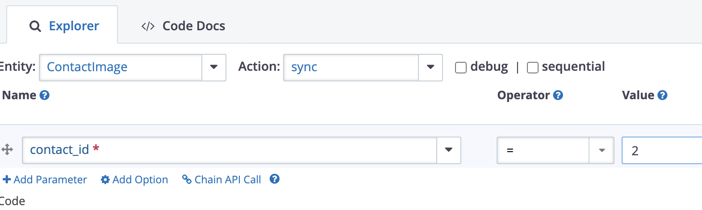

# au.nickperkins.contactimagesync

Extension to assist with syncing CiviCRM contact images to CMS user profiles. The extension adds an APIv3 endpoint and a CiviRules action.


The extension currently only supports Drupal 8+.

The extension is licensed under [AGPL-3.0](LICENSE.txt).

## Requirements

* PHP v7.4+
* CiviCRM 5.61
* [CiviRules](https://civicrm.org/extensions/civirules) (tested with 2.51)
* Drupal 8+

## Installation (Web UI)

Learn more about installing CiviCRM extensions in the [CiviCRM Sysadmin Guide](https://docs.civicrm.org/sysadmin/en/latest/customize/extensions/).

## Installation (CLI, Zip)

Sysadmins and developers may download the `.zip` file for this extension and
install it with the command-line tool [cv](https://github.com/civicrm/cv).

```bash
cd <extension-dir>
cv dl au.nickperkins.contactimagesync@https://github.com/nickperkins/au.nickperkins.contactimagesync/archive/main.zip
```
<!-- or
```bash
cd <extension-dir>
cv dl au.nickperkins.contactimagesync@https://lab.civicrm.org/extensions/au.nickperkins.contactimagesync/-/archive/main/au.nickperkins.contactimagesync-main.zip
``` -->

## Installation (CLI, Git)

Sysadmins and developers may clone the [Git](https://en.wikipedia.org/wiki/Git) repo for this extension and
install it with the command-line tool [cv](https://github.com/civicrm/cv).

```bash
git clone https://github.com/FIXME/au.nickperkins.contactimagesync.git
cv en contactimagesync
```
<!-- or
```bash
git clone https://lab.civicrm.org/extensions/au.nickperkins.contactimagesync.git
cv en contactimagesync
``` -->

## Getting Started

Once enabled, this extension adds a new Civirule action named "Sync Contact Image to CMS".



It is possible to manually sync a contact image using the APIv3. Provide the CiviCRM contact ID to run the sync for.


